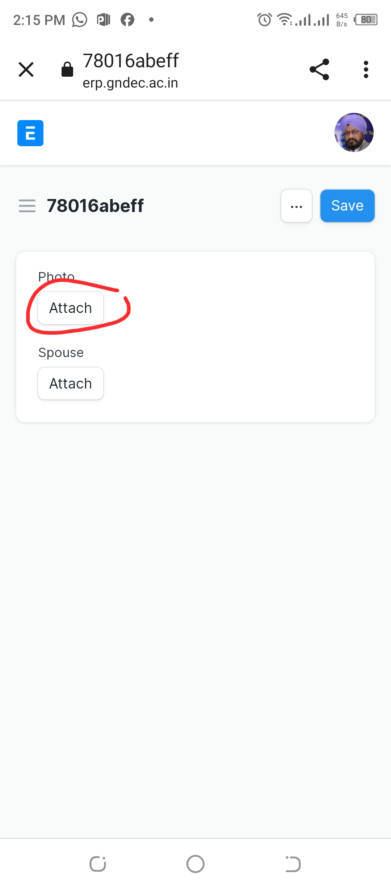
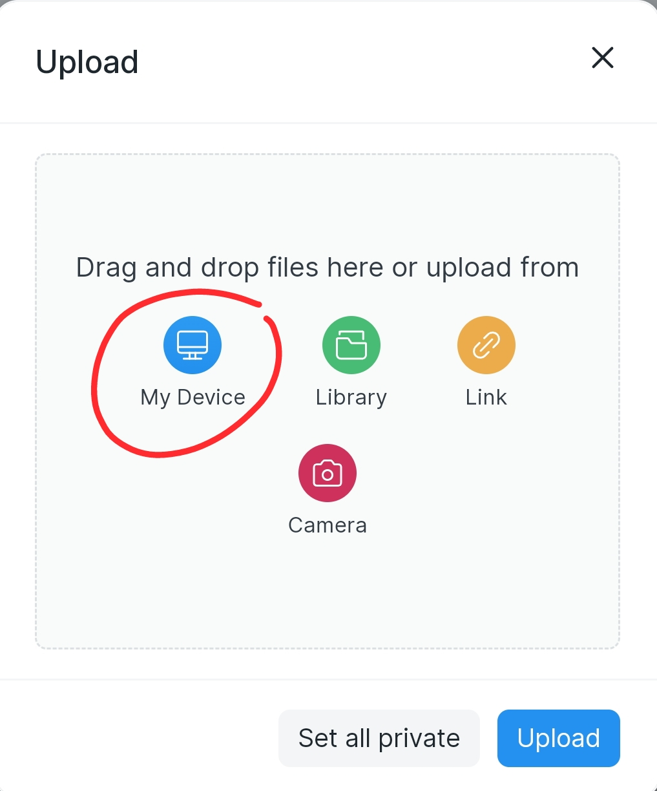
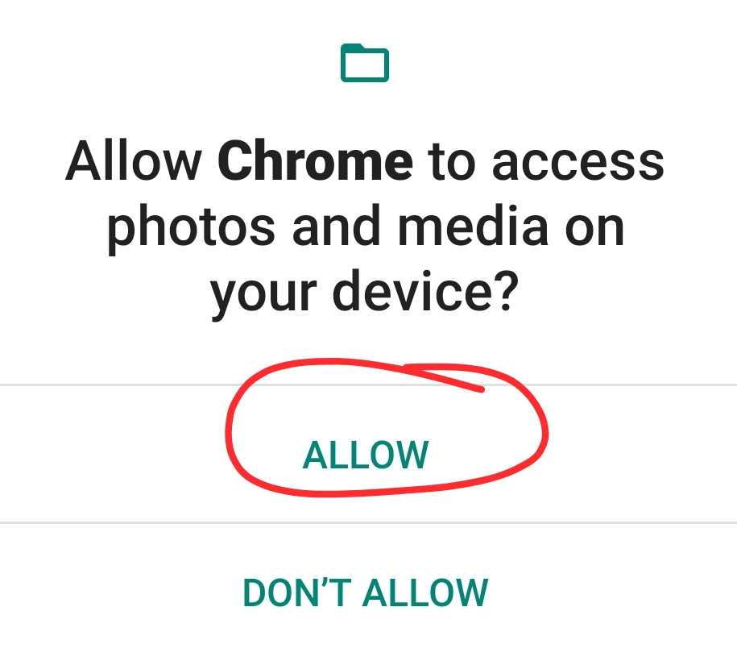
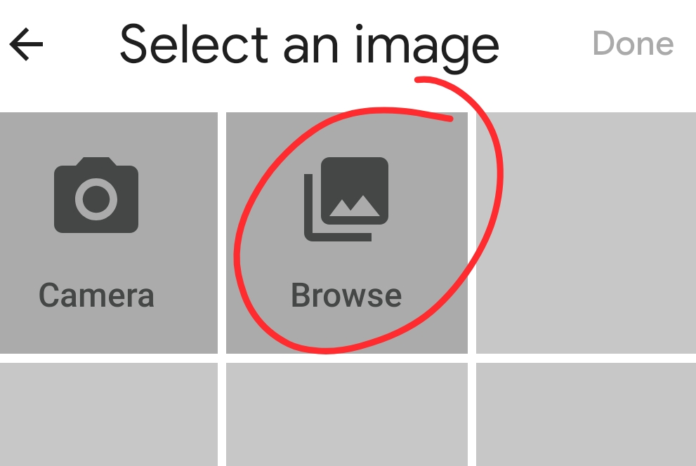
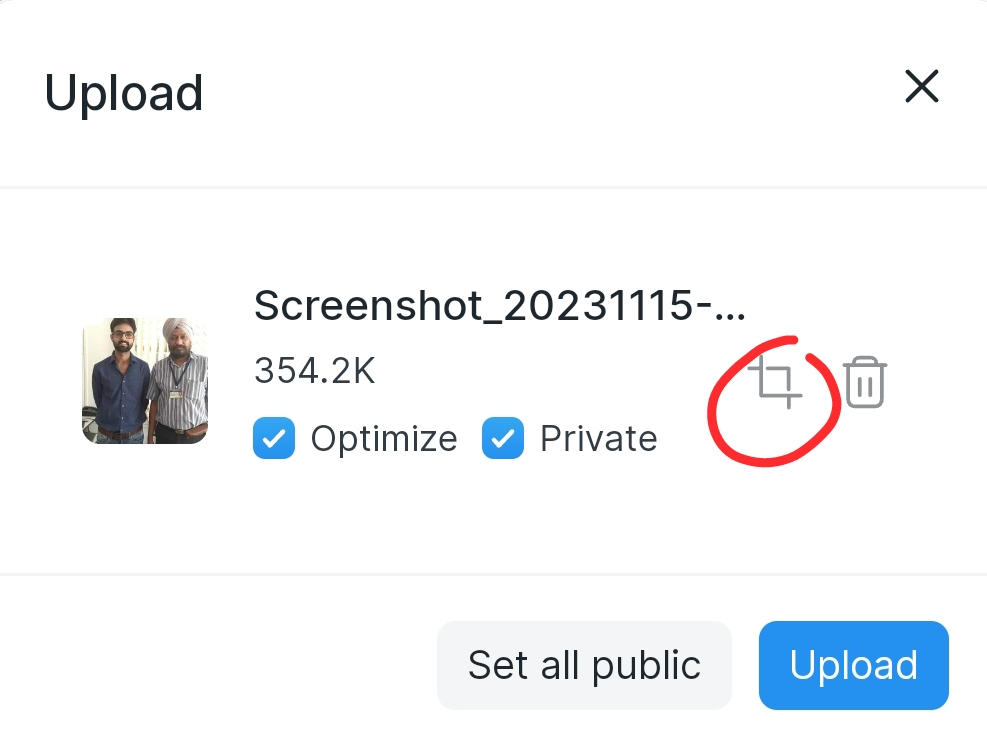
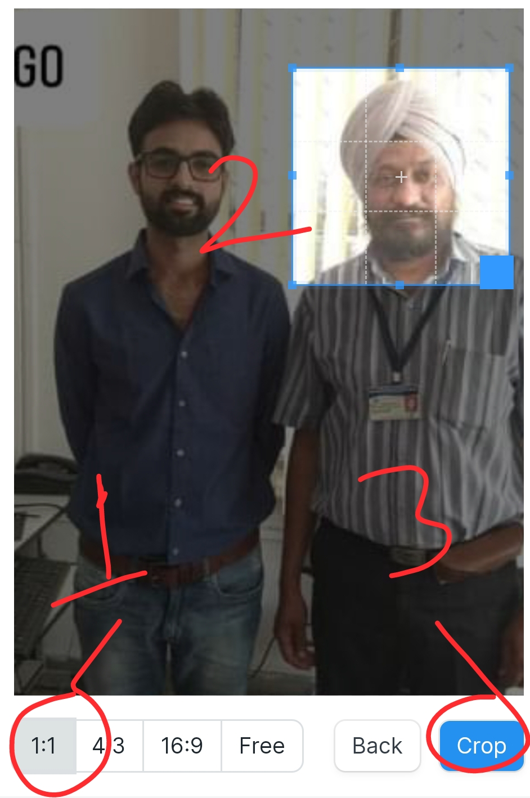
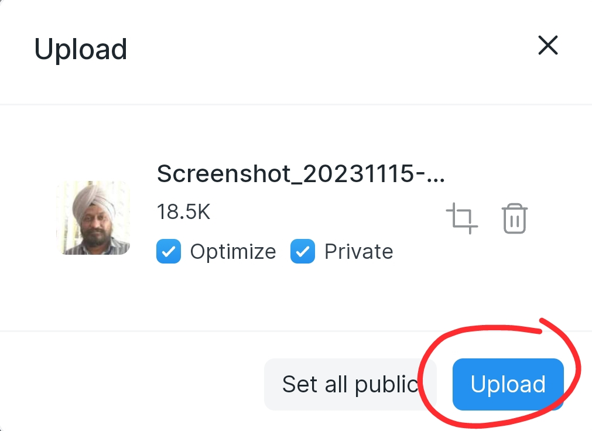
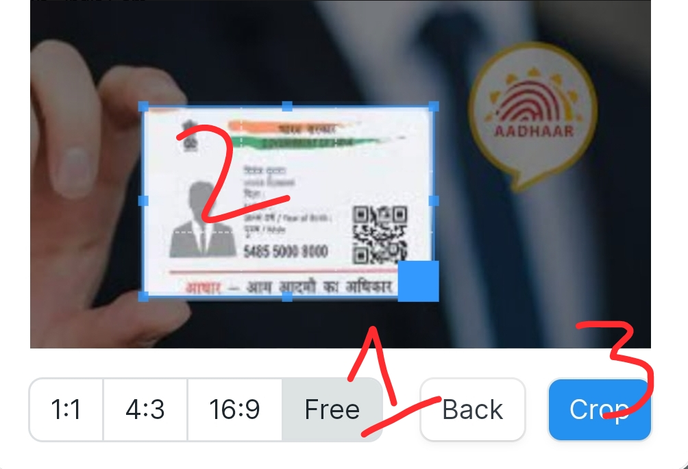
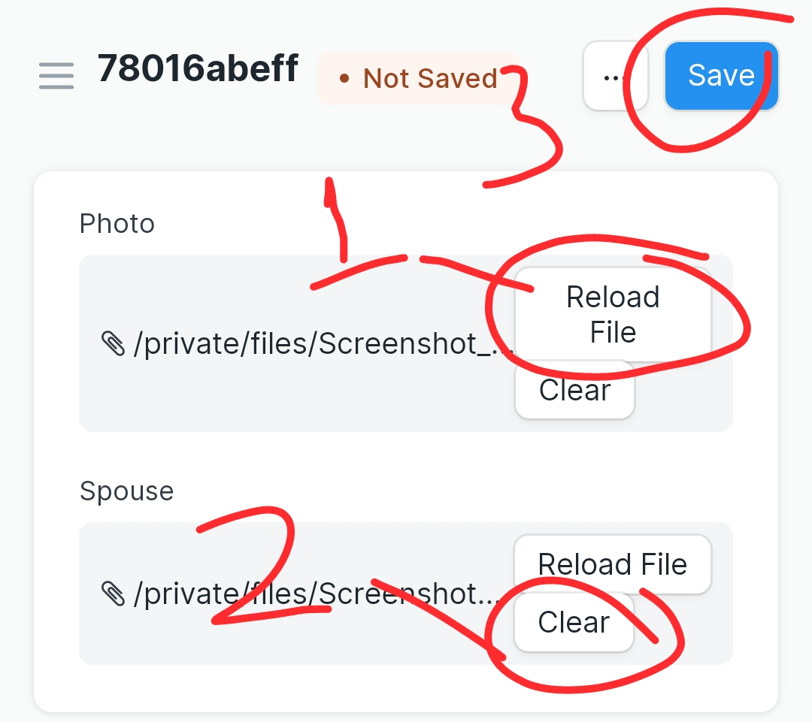
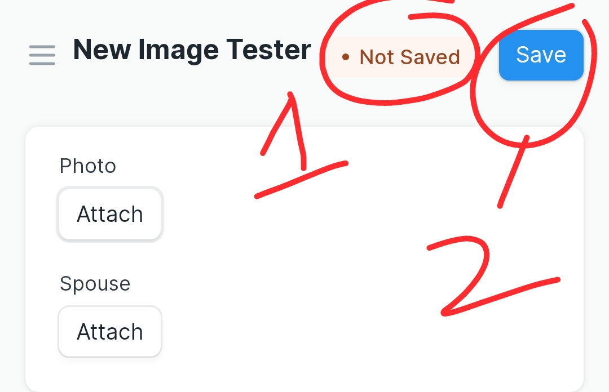

### Image specifications and uploading

1. Ensure that all photos (self, Photo ID) are of excellent quality and meet the specified parameters as per [Photo Specifications](https://gnecoe.github.io/Notices/Files/Photo.html).

2. Crop your personal photo into a square shape, ensuring even lighting and a neutral background, and crop the Photo ID photo to fit the rectangular dimensions of the ID card while maintaining clarity and compliance with ID guidelines.

3. It is advised to have well-processed images stored on your device. Avoid taking selfies; instead, consider going to a professional photographer or ask a friend who's good at photography.

### How to Upload an Image

- To select or choose photo click on attach.

 

- Now to Upload Photo Select the option My Device.

- Allow your Browser to access media on your device.

-  Choose a suitable Photo from your Device.

- Now check the Optimize checkbox.
- And Click on the Crop to Crop your Photo.
  

- Set the Aspect ration 1:1.
- Adjust the Box to make sure to capture your Face properly
- Click on Crop.
- Make sure to Check the Private Checkbox.

- Now Click on Upload.

- Now For your Photo ID Choose Aspect ratio as free.
- Adjust the blue box accordingly.
- Click Crop.

- Click "Reload File" to load the uploaded file (optional).
- Click "Clear" to choose another photo.
- Remember to click "Save" to save your changes.

- It shows Not Saved.
- Click on Save  

- When the document is in draft state, upon being prompted, click "Submit this document" to confirm.
- Then, proceed to click "Submit" to submit your form.

## Next-> [Saving draft and submitting](SaveNSubmit.md)
