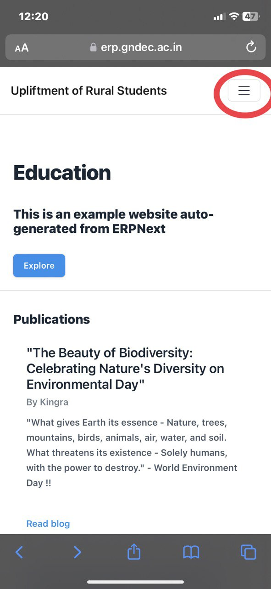
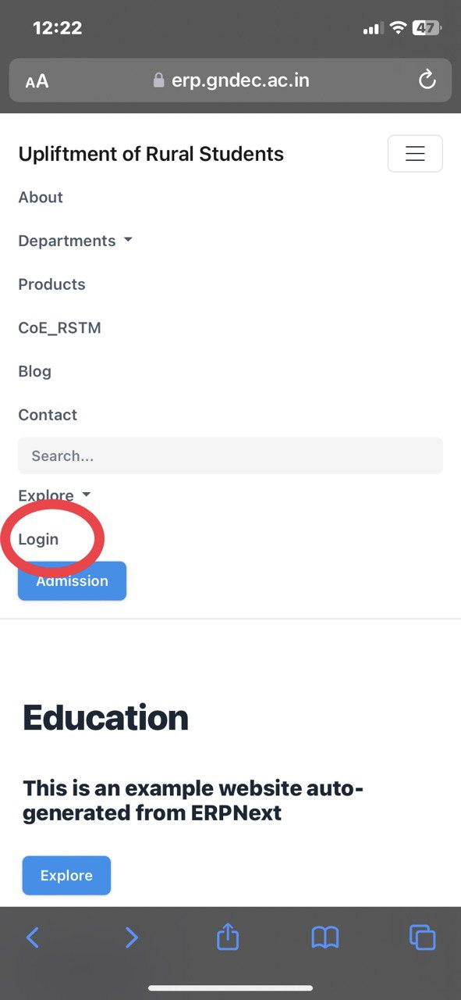
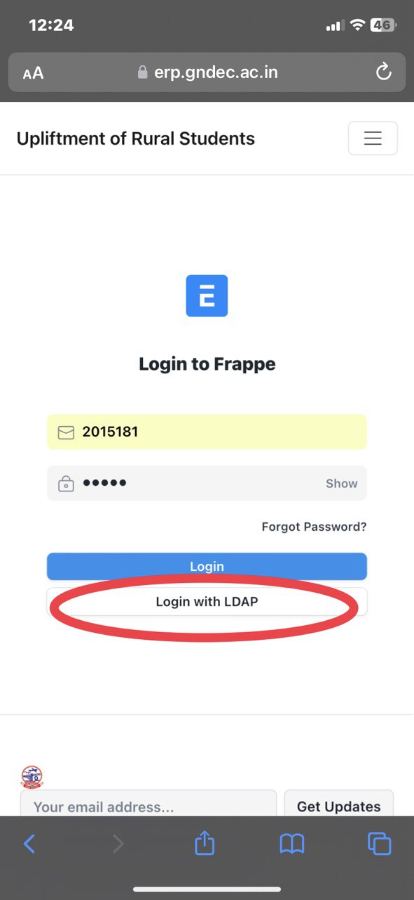

Back to [Instructions for filling the Examination Form](ExamFormMin.md)

### Login Example

- Click / tap on hamburger icon (slide drawer navigation), marked in red circle below:

 
This will show menu, with "Login" towards the bottom (shown in red circle below):

- Click on `Login` Button.

This will show login screen, which can directly be accessed using link [https://erp.gndec.ac.in/login](https://erp.gndec.ac.in/login)

- Fill in your GNDEC Credentials (Class Roll Number (CRN) and password) used for Internet login.

- Click on `Login with LDAP`, i.e. white  button at the bottom (don't use blue button).

### Logout Example

- To logout, click / tap on hamburger icon (slide drawer navigation), shown at `1` in red colour below:

This will show menu, with your profile photo or name initials towards the bottom (shown at `2` in red circle below):

.jpeg)

 
In case there is user image (User Profile Photo), then that will be displayed in place of User's Name Initials, as shown below.

- Click on Profile photo or Name Initials.

This will result in display of "Logout" option as shown at `3` in red below:

.jpeg)

- Click / tap on "Log out".

