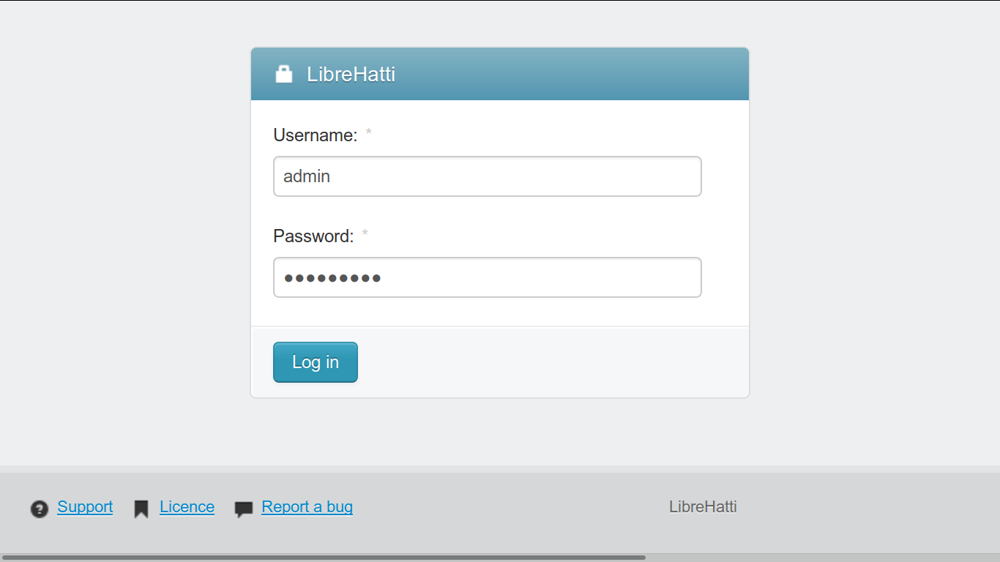
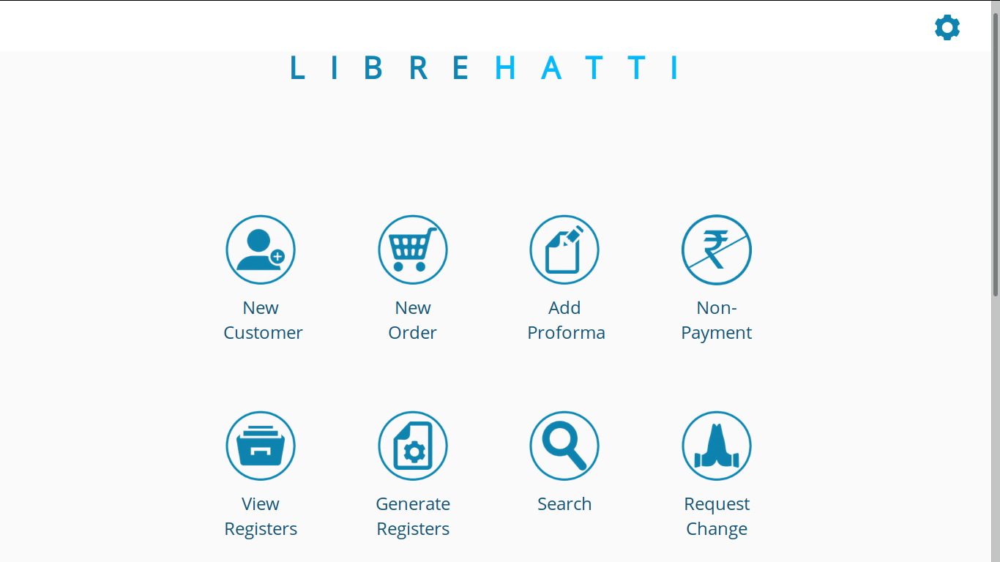
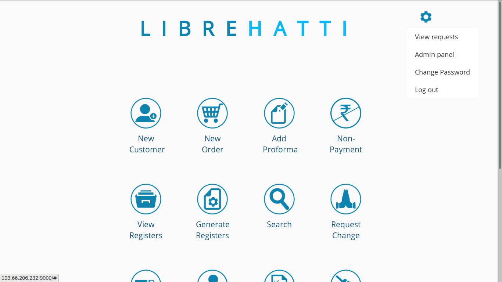

## 1 Installation

### 1.1 Hardware needed

### 1.2 Hardware used

### 1.3 Steps

### 1.4 Struggle

### 1.5 Script

## 2 Using Libre Hatti

### 2.1 Login Screen	

### 2.2 Home Screen after login (1 / 2)	

### Home Screen after login (2 / 2)	

### 2.3 Options from set-up (top right)	

> If you click on `LibreHatti` from top center or top left, then you will be to HOME page as user (non-admin). If you click on `Home` from top left, when you are on admin page (Admin panel), then you will be taken to HOME page of admin user. 

## 3 Company Set-up

You may set up Organisation type, as first step, as it needed for setting up comany as well as to add client companies.

From Home page of admin user, locate [Useraccounts] on left side menu, then click on item [Organisation types from sub-menu, and add following by clicking [Add organisation type] from top right:

- Private
- Government
- Semi-Government

Add address for company to be set-up.

From Home page of admin user -> [Useraccounts] -> [Addresses], click on [Add address], and enter:

- Street address: Gill Park, GNE, Ludhiana
- District: Ludhiana
- Pin: 141006
- Province: Punjab
- Nationality: Country

Pin is optional, while all other are must.

To set-up a new company, from admin page, [Useraccounts] -> [Admin Organisations], then click on [Add admin organisation] from top right.

- User: Select exisiting user (if there is any) or add new by clicking + sign on right side
- Address: Select exisiting address (if there is any) or add new by clicking + sign on right side
- Telephone: 0161-2491193
- Fax: 0161-2491193
- Pan no: 
- Stc no: AAATN1978LSD001
- Gst in: 03AAATN1978L2ZB
- State: Punjab
- State code: 03
- Avatar:
- Tagline: Serving society technically
- Title: Tessting and Consultancy Cell
- Organisation type: Private

## 4 Add user / customer

Satff or client (customers) are added, either from:

1. [User home] -> New Customer or
2. [Adminhome] -> Authentication and authorization -> User -> [Add user]

- Username:
- Email address:
- First name:
- Last name:
- Password:
- Password confirmation:

---

- Address:
- Telephone:
- Fax:
- Pan no:
- Stc no:
- Gst in:
- State:
- State code:
- Avatar:
- Tagline:
- Title:
- Is org
- Org type:
- Company

> Username, Password, Address, Telephone and Org tupe are mandatory.

## 5 Add units

From [Admin panel] -> catalog -> Units -> [Add unit]

- Unit:

For example:

- Sq metre
- Set
- Nos

## 6 Add product / service groups

From [Admin panel] -> catalog -> category -> [Add category]

- Name:
- Parent:
- Unit:

Tree may looks like:

1. SoM
    1. Field
        1. Cube
        2. Brick
    2. Lab
        1. Cube
        2. Brick
1. Design
    1. Architectural
    1. Structural

## 7 Add product / services

## 8 Non-payment order

Query or purchase order received, for which payment is no received.

From [Admin Panel] -> Catalog -> Non payment orders -> Add non payment order

- Client:
- Letter No.
- Letter Date:
- Site:
- Item type:

